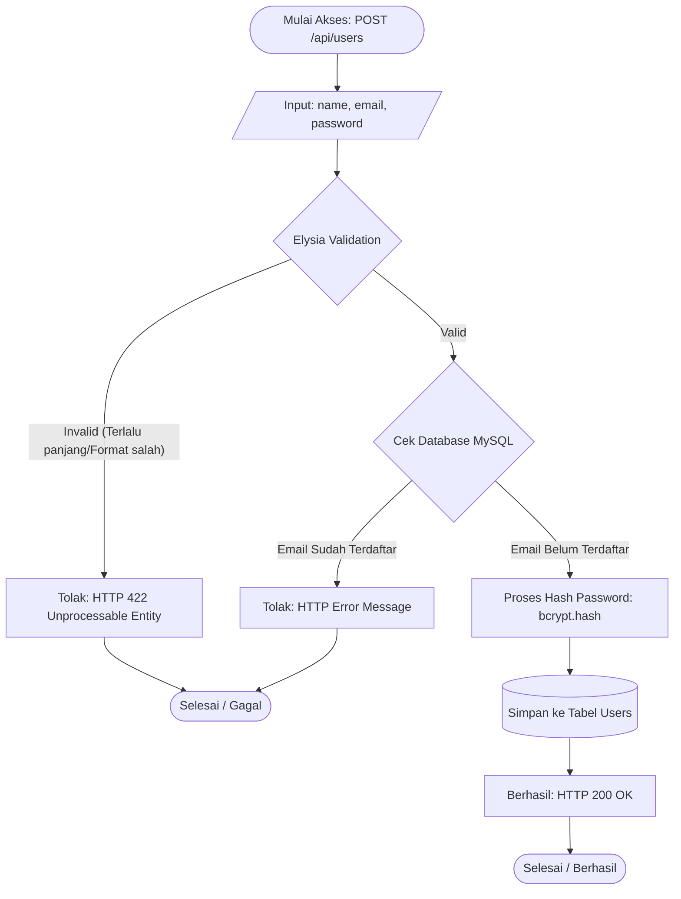

# Belajar Vibe Coding

Aplikasi ini adalah proyek pembelajaran *backend* modern yang dikembangkan dengan pendekatan performa tinggi menggunakan ekosistem **Bun** terbaru. Proyek ini menyajikan spesifikasi layanan REST API untuk Autentikasi Pengguna yang meliputi Registrasi, Login, Autorisasi Profile, dan Logout, dengan koneksi aman dan efisien ke *database* MySQL.

---

## 🚀 Tech Stack & Libraries
Proyek ini dibangun memanfaatkan teknologi-teknologi unggulan sebagai berikut:
- **Runtime:** [Bun](https://bun.sh/) (*Incredibly fast* JavaScript/TypeScript runtime & *package manager*)
- **Framework REST API:** [ElysiaJS](https://elysiajs.com/) (Web framework ergonomik untuk Bun)
- **ORM:** [Drizzle ORM](https://orm.drizzle.team/) (Solusi *TypeScript ORM* yang tangguh)
- **Database:** MySQL 8.0 (Terisolasi di dalam wadah Docker)
- **Kriptografi:** `bcrypt` (Untuk rutinitas Hashing Password)
- **Testing:** `bun:test` (Kerangka uji bawaan dari ekosistem Bun)

---

## 📂 Arsitektur & Struktur Direktori

Kode aplikasi ditata mempergunakan model **Layered Architecture** (*Controller-Service-Repository*), mengutamakan struktur kustom yang rapi guna pemisahan tugas (Separation of Concerns). Skema penamaan *file* sepenuhnya konsisten pada format `kebab-case.ts`.

```text
belajar-vibe-coding/
├── src/
│   ├── db/                 # Lapisan Data & Setup Drizzle
│   │   ├── index.ts        # Konektor *Pooling Database* 
│   │   └── schema.ts       # Basis cetak biru tabel (skema)
│   ├── routes/             # Lapisan Kontrol (Routing HTTP)
│   │   └── users-route.ts  # Elysia routes, tipe data & handler body
│   ├── services/           # Lapisan Logika Bisnis
│   │   └── users-service.ts# Fungsionalitas otentikasi inti 
│   └── index.ts            # Entry-point (Server Induk Elysia)
├── tests/                  # Direktori Pusat Pengujian (*Unit Tests*)
│   ├── index.test.ts       # Pemeriksaan Base Route
│   └── users.test.ts       # Skenario ekstensif fungsionalitas Auth
├── drizzle/                # Perekaman status migrasi SQL
├── docker-compose-sql.yml  # Docker deployment untuk infrastruktur MySQL
├── package.json            # Registri Metadata NPM / Bun
├── tsconfig.json           # Setelan kompilasi TypeScript
├── bun.lock                # Deterministic lockfile
└── .env                    # Lingkungan konfigurasi rahasia (*ignored by git*)
```

---

## 🗄️ Database Schema

Sistem me-rotasikan dua struktur tabel yang relasional berlandaskan `drizzle-orm`:

1. **`users`**
   Melacak identitas primer pada pengguna.
   - `id` — (INT, Serial AUTO_INCREMENT) - *Primary Key*
   - `name` — (VARCHAR 255)
   - `email` — (VARCHAR 255) - *Unique Index*
   - `password` — (VARCHAR 255) - Diacak/disandikan oleh bcrypt
   - `createdAt` — (TIMESTAMP)

2. **`sessions`**
   Penyimpan status kelangsungan / keabsahan akses (*Token Bearer*).
   - `id` — (INT, Serial AUTO_INCREMENT) - *Primary Key*
   - `token` — (VARCHAR 255) - Random UUID atau representasi identik
   - `userId` — (INT) - Kunci tamu ke `users.id`
   - `createdAt` — (TIMESTAMP)

---

## 🌐 Rancangan API (The Endpoints)

Rute komunikasi klien dan sistem (*server listening default* di `http://localhost:3000`):

| Method | Endpoint | Tujuan | Syarat Headers | Body (JSON Format) |
|--------|---------|------------|---------|-------------|
| `GET` | `/` | Rute dasar konfirmasi server | - | - |
| `POST` | `/api/users` | Membuat dan meresmikan pengguna baru | - | `name`, `email`, `password` |
| `POST` | `/api/users/login` | Akses sistem & pembuatan Sesi Server | - | `email`, `password` |
| `GET` | `/api/users/me` | Autorisasi identitas otentik yang spesifik | `Authorization: Bearer <token>` | - |
| `DELETE`| `/api/users/logout`| Pemutusan sesi, merusak validasi Token | `Authorization: Bearer <token>` | - |

### 🔄 Alur Registrasi Pengguna
Berikut adalah visualisasi diagram alir (*Flowchart*) dari proses pendaftaran (*Registration*) pengguna baru:



---


## ⚙️ Cara Set Up Project

Prasyarat untuk menempuh perjalanan membangun aplikasi ini di lokal hanyalah mempersiapkan **[Bun](https://bun.sh/)** dan **Docker/Docker Compose**.

1. **Unduh Repositori Terkait:**
   ```bash
   git clone <tautan_repo>
   cd belajar-vibe-coding
   ```

2. **Instalasi Paket Dependensi:**
   ```bash
   bun install
   ```

3. **Inisialisasi Lingkungan Database:**
   Proses memantik MySQL instance tak terpaut pada mesin host.
   ```bash
   docker compose -f docker-compose-sql.yml up -d
   ```

4. **Sinkronisasi Pembuatan Schema (Drizzle Push):**
   ```bash
   bun run db:push
   ```

---

## ▶️ Cara Run Aplikasi

Aplikasi dibangun dari ground-up untuk keleluasaan para peretas (*Developer*). Cukup manfaatkan script bawaan untuk `watch mode`:

```bash
bun run dev
```

Anda akan menjumpai pesan hijau di terminal `Server running at http://localhost:3000`. 

---

## 🧪 Cara Test Aplikasi

Ekosistem Bun dirancang dengan sarana *testing* (*runner*) secara inheren. Di proyek ini, tes dilakukan dalam lingkup modul (*Service Mocking Parameter*), yang membuktikan skema route dan parameter tidak memiliki ketergantungan sejati pada beban latensi Database demi efisiensi CI/CD.

Jalankan perintah pengujian tunggal:

```bash
bun test
```
*Atau, periksa luasan uji tes dengan detail flag verbose bila dibutuhkan:*
```bash
bun test tests/ --coverage
```
